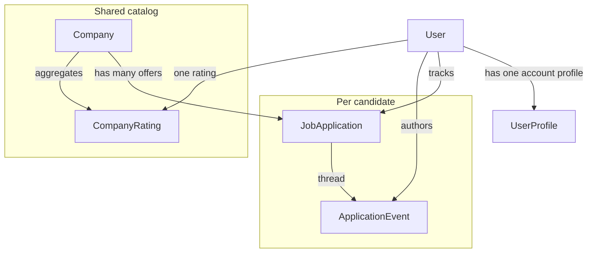

# CVGen docs

Markdown with Mermaid diagrams. GitHub, GitLab, and most Markdown previews render the `mermaid` fences as graphs.

## Contents

| Document | What it covers |
| --- | --- |
| [Data model](data-model.md) | Full ERD, tables, uniqueness, ratings formula |
| [Account](account.md) | About-me, avatar, stored CV analysis (`user_profiles`) |
| [Companies](companies.md) | Shared Glassdoor-style catalog, legal identity, employer vs agency |
| [Ratings](ratings.md) | Global 0–5 scores, overall `3.6`, one rating per user per company |
| [Applications](applications.md) | Tracker row, search, nested company create |
| [Timeline](timeline.md) | In-app communication thread and status history |

## Domain at a glance

Company names are **not** unique. The catalog key is **country + legal identifier** (NIP, KRS, VAT, EIN, company number). Applications store `company_id` (UUID), never a denormalized name string.

Ratings are global, like Glassdoor: every candidate who rates Google Poland updates the same company card. Communication stays inside CVGen (no mail/IMAP).
