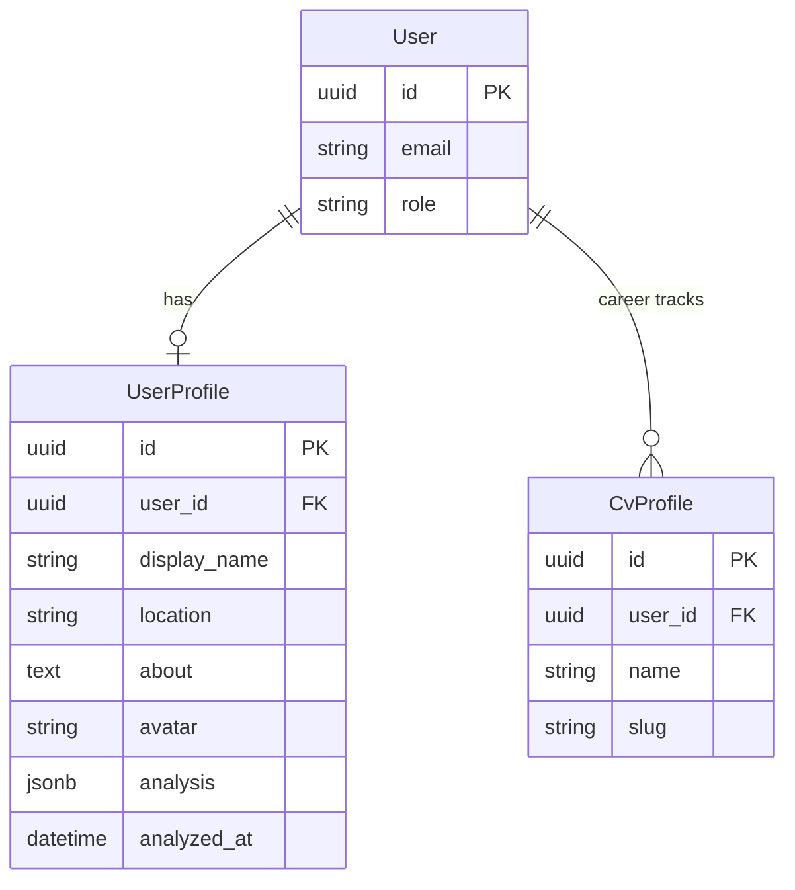
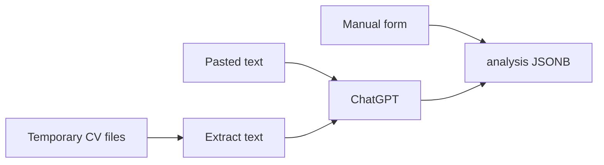

# Account profile

The signed-in person has one **account profile** (`user_profiles`), separate from CV **career tracks** (`cv_profiles`). This is “about me”, a photo, and the latest structured CV analysis (ChatGPT JSON) — editable in a form.

`users` stays a Devise record (email, password, role). Preferences that are already cookies (`locale`) or `localStorage` (theme) do not live here.

## Why not JSONB on `users`?

A blob on `users` would mix authentication with a growing document. Avatar needs a CarrierWave column anyway. A 1:1 `user_profiles` table keeps:

- typed fields for the Gmail-style header (name, photo, bio)
- `analysis` JSONB for the evolving GPT schema
- room for `analyzed_at` without touching Devise

A `user_preferences` table would be the right home for UI flags (theme, column layout). Those are not this.

## ERD



## Analysis JSON

Same shape as `config/prompts/cv_analysis.txt`. Empty strings / empty arrays when unknown. The account form shows only sections that already have data. Languages are `{ name, level }` (legacy `"English"` strings are still accepted and normalized).

```json
{
  "person_name": "Ada Lovelace",
  "headline": "Mathematician",
  "summary": "Notes on the Analytical Engine.",
  "contact": {
    "email": "ada@example.com",
    "location": "London",
    "phones": [{ "label": "Mobile", "number": "+44 7123 456789" }],
    "links": [{ "label": "LinkedIn", "url": "https://linkedin.com/in/ada" }]
  },
  "skills": ["Mathematics"],
  "languages": [
    { "name": "English", "level": "C1" },
    { "name": "French", "level": "B2" }
  ],
  "experience": [
    {
      "company": "Analytical Engine",
      "role": "Collaborator",
      "from": "1842",
      "to": "1843",
      "highlights": ["Bernoulli numbers"]
    }
  ],
  "education": [
    { "school": "Private tutors", "degree": "Mathematics", "year": "1834" }
  ],
  "strengths": ["Abstraction"],
  "gaps": ["Industry experience"]
}
```

`UserProfile#apply_analysis!` writes that hash, stamps `analyzed_at`, and fills `display_name` from `person_name` when the name is still blank.

## How analysis gets in

Three ways, same JSON, same editable form:



| Path | What happens |
| --- | --- |
| Form | Edit filled fields, Save. Empty analysis sections stay hidden. Lists are one item per line. |
| Paste | Cover letter, LinkedIn export, copied CV. `POST /jobseeker/account/analyze`. |
| Files | Up to 5 files, 8 MB each: PDF, doc, docx, ODT, RTF, TXT, Markdown, HTML, or a photo of a CV. **Not stored** — discarded after the request. TXT/DOCX/ODT/DOC/RTF/PDF text is extracted locally; images go to the model as attachments. A PDF with no selectable text is rejected (paste the CV instead). |

Multiple sources in one request are merged (union skills, languages by name, richer experience). A previous analysis is sent as a draft so a second import enriches instead of wiping.

## UI

- `/jobseeker/account` — about you + import. After analysis, only filled sections (skills, languages with level, experience, education, contact…) appear.
- `/jobseeker/profiles/:id` — split editor: raw Markdown on the left and a WYSIWYG editor on the right (icon toolbar, contenteditable body, front matter as fields). Both panes share the same height; edits sync both ways. Save stores a new version. Phone/link front matter is normalized (`label` + `number` / `url`) so Typst layouts can compile. ChatGPT drafts run in Sidekiq; the profile list does not poll.
- `/jobseeker/profiles/new` — name a career track, then upload cvgen Markdown **or** queue a background ChatGPT draft from the account JSON. The track name is the filter: mixed careers stay on My profile; this Markdown keeps only matching roles.
- Top-right avatar (person icon until a photo is uploaded) opens a Gmail-style menu: identity, My profile, Log out
- Sidebar **Profiles** is career-track Markdown, not the account page
