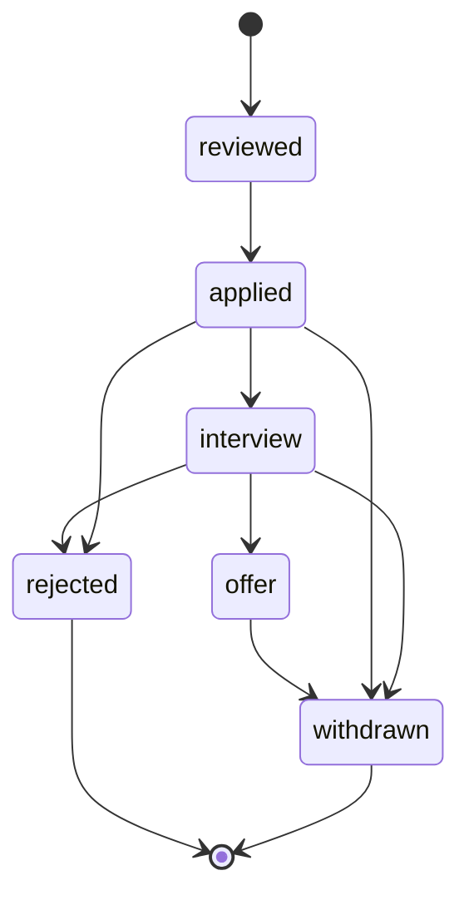
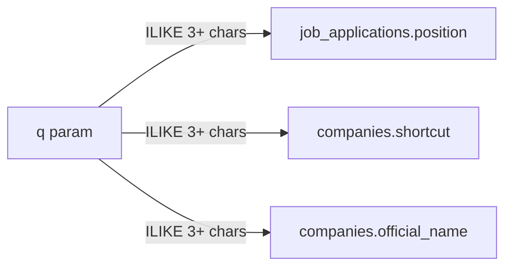

# Applications

A job application is the candidate’s tracker row for one vacancy at one `Company`.

## Lifecycle

Statuses are not a strict state machine in code: any status can be set from the form. The diagram is the intended happy path plus drop-off.

`rejected` and `withdrawn` require a `dropout_reason` on that transition (`ghosting`, `no_offer`, `candidate_withdrew`, `process_joke`, `other`).

## Communication thread

See [Timeline](timeline.md). Events stay in CVGen (no mail integration). The thread answers: where the process stopped, and why.

## Search

Index search (`q` with 3+ characters) matches `position` and the company’s `shortcut` / `official_name` via `LEFT JOIN` — not a denormalized company string. Queries shorter than three characters are ignored (full list).

Status chips still filter `job_applications.status`. Infinite scroll stays at 30 rows per page.

## Index columns

Default visible: `position`, `company`, `posted_on`, `status`.

Optional: `expected_salary`, `offered_salary`, `work_mode`, `employment_type`, `contract_type`, `link`, `email`.

The company cell links to the catalog card. The row still opens the application modal (timeline + message form).
