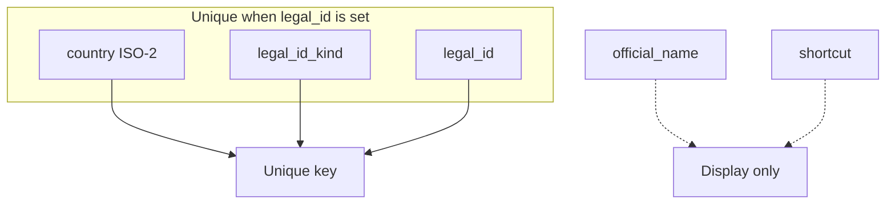
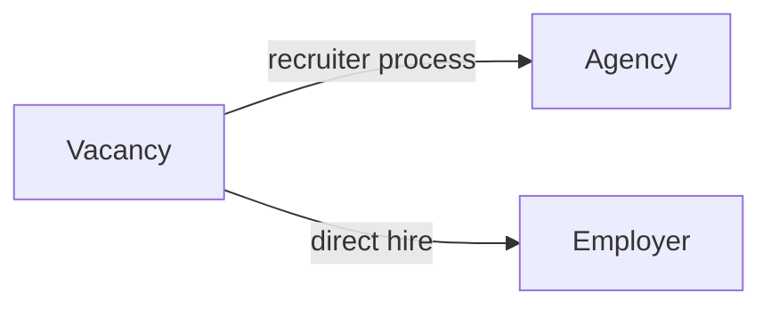
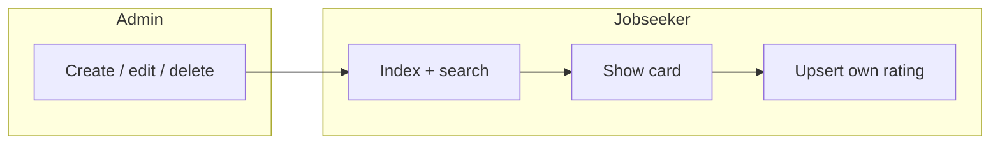
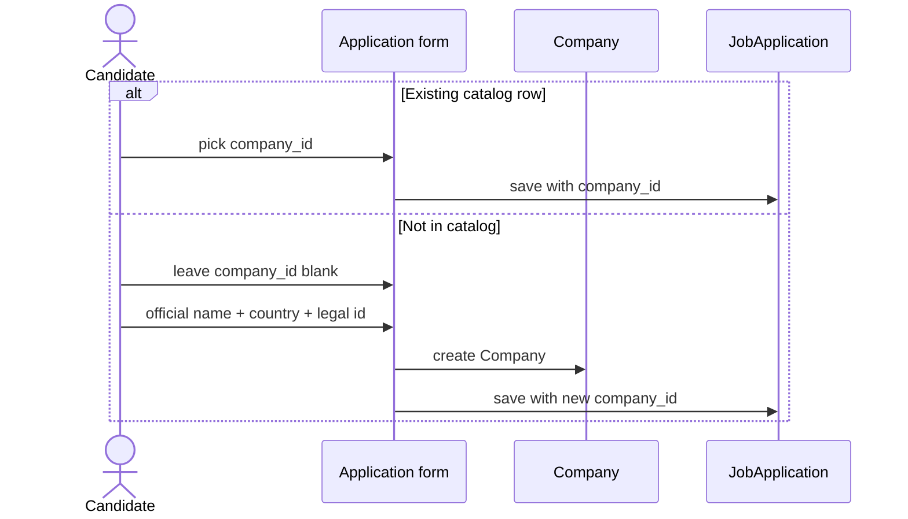

# Companies

Shared catalog: one legal row for Google Poland vs Google Ireland, not one row per candidate. Two agencies named “Strategic Staffing” in different countries are two rows.

## Legal identity

`legal_id_kind`: `nip`, `krs`, `vat`, `ein`, `company_number`, `other`.

Whitespace and hyphens are stripped from `legal_id` before save (`525-234-40-78` → `5252344078`).

New companies from the UI require country + identifier. Legacy tracker strings may be backfilled without a number (partial unique index).

Display:

- `display_name` — shortcut if present, otherwise official name
- `label` — used in selects: `YND · YND Sp. z o.o. · PL`

## Type

| `kind` | Meaning |
| --- | --- |
| `employer` | Direct employer |
| `agency` | Job / recruitment agency |

The application still points at **one** company: whichever legal entity the candidate is dealing with. A later version can add a second optional `employer_id` if an agency process needs both; v1 does not.

## Catalog UI

Search (`q`, 2+ characters) matches shortcut, official name, and legal id (`ILIKE`).

Jobseeker cannot merge or delete companies. Admin can edit identity fields. Delete is blocked while applications still reference the row (`restrict_with_error`).

## Creating a company from an application

If `company_id` is present, nested `company_attributes` are ignored so an accidental fill of the “new company” fieldset cannot fork a duplicate.
