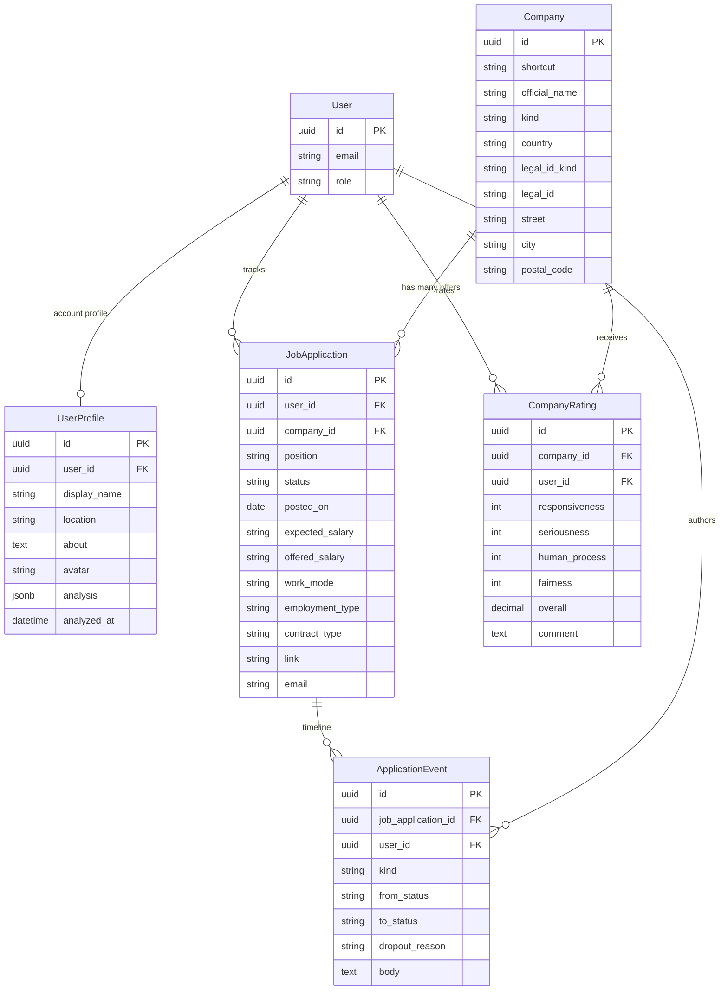
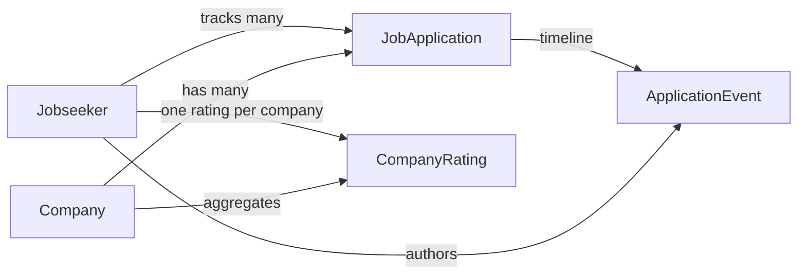

# Data model

Company is a **shared legal entity** (Glassdoor-style catalog). Job applications belong to a company by UUID. Candidates rate companies; communication and status history live on the application.

Primary keys are UUIDs. `job_applications.company` (string) is removed after backfill.

## ERD

## Relationships

## Identity rules

| Field | Unique? | Notes |
| --- | --- | --- |
| `shortcut` | no | Same label can exist in another jurisdiction |
| `official_name` | no | Same trade name, different legal entity |
| `(country, legal_id_kind, legal_id)` | yes, when `legal_id` is present | Partial unique index `index_companies_on_legal_identity` |

`kind` is `employer` (direct hiring company) or `agency` (recruitment firm).

New companies from the UI require country + identifier. Tracker rows backfilled from the old string column may lack a number (`legacy_record?`); the unique index ignores those rows.

## Company fields

| Column | Type | Required (new rows) |
| --- | --- | --- |
| `shortcut` | string(40) | no |
| `official_name` | string(160) | yes |
| `kind` | enum `employer` / `agency` | yes, default `employer` |
| `country` | ISO-2 from a fixed list | yes |
| `legal_id_kind` | `nip` `krs` `vat` `ein` `company_number` `other` | yes |
| `legal_id` | string(40), whitespace stripped | yes |
| `street` `city` `postal_code` | string(160) | no |

## Job application fields

| Column | Notes |
| --- | --- |
| `company_id` | UUID FK, required |
| `position` | required, max 160 |
| `status` | `reviewed` `applied` `interview` `offer` `rejected` `withdrawn` |
| `posted_on` | optional date |
| `expected_salary` `offered_salary` | free text (ranges allowed) |
| `work_mode` | `remote` `hybrid` `onsite` |
| `employment_type` | `full_time` `part_time` `contract` |
| `contract_type` | `b2b` `employment` `mandate` `specific_task` |
| `link` `email` | optional, format-validated |

Virtual attributes on create/update (not columns): `status_note`, `dropout_reason`. They are written onto the resulting `ApplicationEvent`.

## Rating

Each dimension is an integer **0–5** (0 = “does not exist”). A candidate’s `overall` is the arithmetic mean of the four dimensions, stored as `decimal(2,1)` (for example `3.6`). The company’s public rating is the mean of those overalls, shown with one decimal place.

Unique `(company_id, user_id)` — one card per candidate.

## Timeline

`ApplicationEvent.kind` is `status_change` or `message`. Status changes are written automatically when an application is created or its status changes. Dropout reasons (`ghosting`, `no_offer`, `candidate_withdrew`, `process_joke`, `other`) attach to `rejected` / `withdrawn` transitions.

## Destroy rules

| Record | Dependent |
| --- | --- |
| `User` | destroys account profile, applications, ratings, authored events |
| `Company` | `restrict_with_error` while applications exist; ratings destroyed with the company |
| `JobApplication` | destroys its events |

Account identity (`user_profiles`) is 1:1 with `users`. `analysis` JSONB holds the latest ChatGPT CV parse; see [Account](account.md). `cv_profiles` are career-track Markdown. A new track can be an uploaded file or a ChatGPT draft from the account JSON, filtered by the profile name (one person, several careers).
