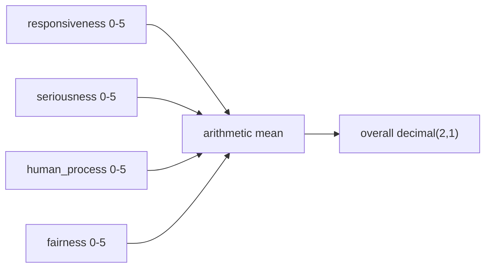
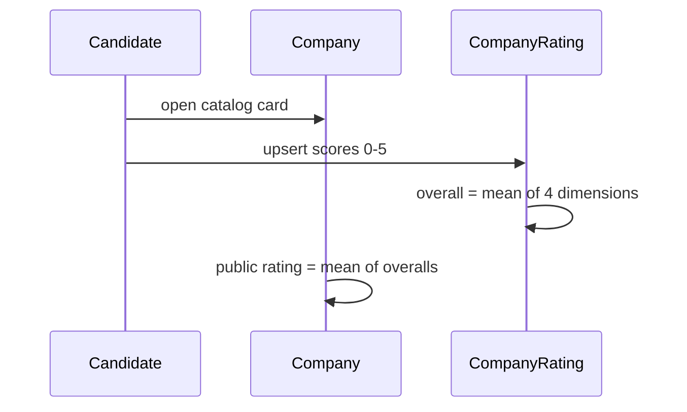

# Ratings

Global, Glassdoor-style scores on the **company**, not on a single vacancy. One row per `(user, company)`.

## Dimensions

| Key | Meaning |
| --- | --- |
| `responsiveness` | Do they reply, and how fast? |
| `seriousness` | Is the process real, or theatre? |
| `human_process` | Are people treated like people? |
| `fairness` | Compensation, feedback, and honesty |

Each score is an integer **0–5**. **0 means “does not exist”** for that dimension (for example: no process to speak of).

## Overall

Example: `5, 4, 3, 2` → `(5+4+3+2)/4` → **3.5**.

The stored `overall` is rounded to one decimal place. The company card shows the **mean of all candidates’ overalls**, also one decimal (for example `3.6`).

## Constraints

- Unique index on `(company_id, user_id)`
- Comment optional, max 2000 characters
- Jobseeker routes: `POST/PATCH /jobseeker/companies/:id/rating`
- Changing a score updates the same row; it does not insert a history of ratings

## What ratings are not

They are not per-application. Two roles at the same legal entity share one score from that candidate. They are not imported from Glassdoor or Google — they exist only inside CVGen.
