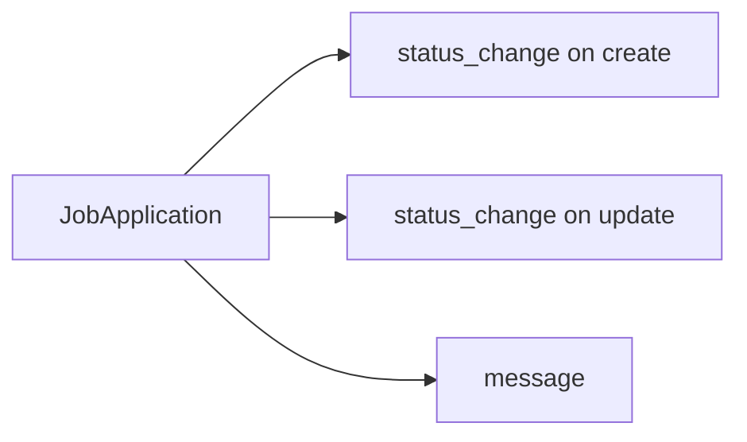
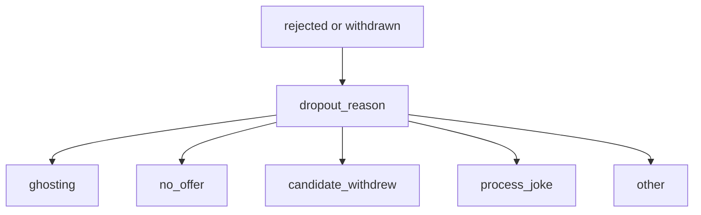

# Timeline

Each `JobApplication` has an ordered thread of `ApplicationEvent` rows. This is in-app only — there is no IMAP, mailbox, or outbound mail.

## Event kinds

| `kind` | When | Fields |
| --- | --- | --- |
| `status_change` | After create, and after `status` changes | `from_status`, `to_status`, optional `dropout_reason`, optional `body` from `status_note` |
| `message` | Candidate posts in the modal | required `body` |

## Dropout

`dropout_reason` is validated on the application when the **new** status is `rejected` or `withdrawn`. It is copied onto the `status_change` event. Later edits that do not change status do not require it again.

## Authorship

Every event belongs to the signed-in `User`. There is no recruiter reply channel in v1; the thread is the candidate’s log of what happened.

Events are listed chronologically (`created_at`, `id`) in the application modal. `POST /jobseeker/applications/:id/events` adds a `message`.
